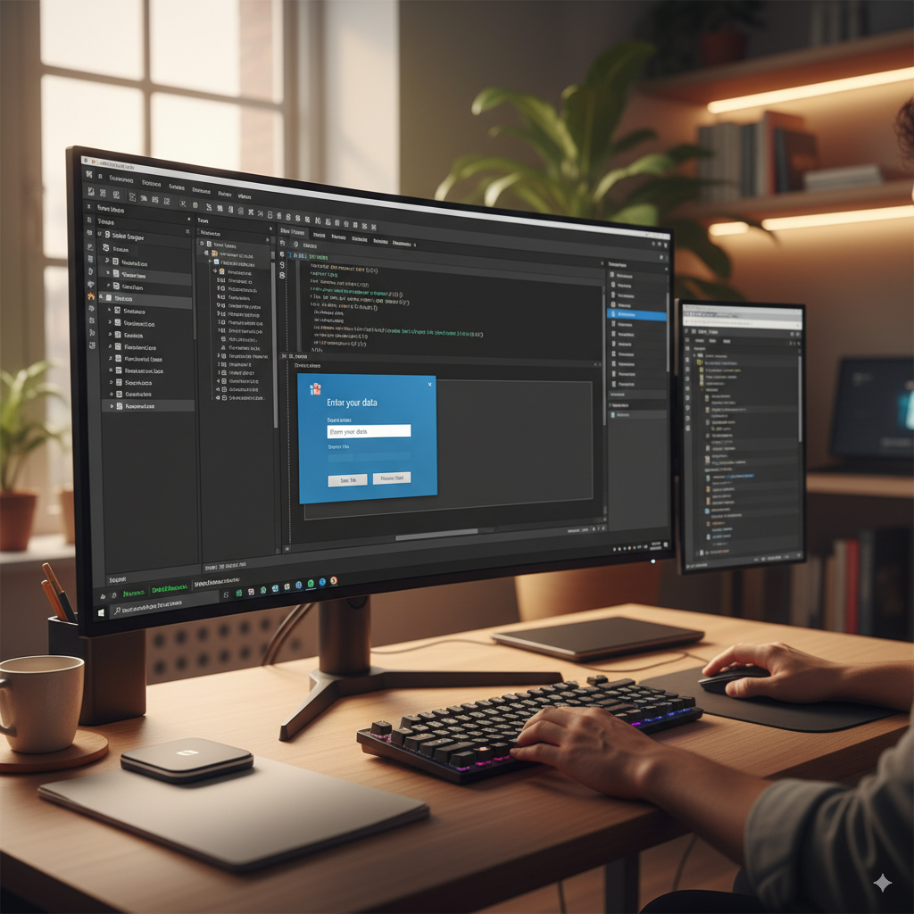

Here's a `README.md` file for your `IDEMyOK` project, incorporating your specifications.

```markdown
# IDEMyOK - Desktop and Development Environment

## Project Name
abakomyok

## Project Overview
IDEMyOK is a personal Integrated Development Environment (IDE) and desktop environment designed for rapid development, focusing on ease of use and a familiar interface reminiscent of classic programming environments like QBasic. This project, `abakomyok`, aims to provide a robust framework for creating and managing development files, with a strong emphasis on Visual Basic for application development.

## Core Features

*   **QBasic-like Editor:** A text editor component designed to mimic the simplicity and directness of QBasic's interface, optimized for Visual Basic code.
*   **Integrated Desktop Environment:** A customizable desktop interface that allows users to organize development projects, files, and tools.
*   **File Management:** Tools for creating, opening, saving, and managing project files and source code.
*   **Visual Basic Focus:** The primary development language supported by the IDE is Visual Basic, with features tailored to its syntax and project structure.
*   **Project Management:** Basic functionalities for creating and managing projects, potentially including build processes (though initially focusing on code editing).

## Technology Stack

*   **Primary Development Language:** Visual Basic (VB.NET or potentially VBA for embedded scripting within the environment itself)
*   **Target Framework:** .NET Framework (for Windows Desktop Applications)

## Getting Started

### Prerequisites
*   Visual Studio (or equivalent .NET development environment)
*   .NET Framework SDK

### Installation
1.  Clone the repository:
    ```bash
    git clone [repository_url_here]
    ```
2.  Open the `abakomyok.sln` solution file in Visual Studio.
3.  Build the solution to restore any necessary NuGet packages and compile the project.

### Running the Application
1.  After building, run the `abakomyok` executable from within Visual Studio or navigate to the `bin/Debug` (or `bin/Release`) folder and launch the `.exe` directly.

## Development

### Project Structure
The project will likely be structured with several key components:

*   **`Source/`**: Contains all Visual Basic source code files.
    *   `Forms/`: UI forms for the desktop, editor, and other tools.
    *   `Modules/`: General utility modules and classes.
    *   `Controls/`: Custom controls developed for the IDE.
*   **`Assets/`**: Icons, images, and other resources.
*   **`Docs/`**: Project documentation (like this README).
*   **`Projects/`**: A directory where `IDEMyOK` projects created by the user will reside (example).

### How to Contribute
1.  Fork the repository.
2.  Create your feature branch (`git checkout -b feature/AmazingFeature`).
3.  Commit your changes (`git commit -m 'Add some AmazingFeature'`).
4.  Push to the branch (`git push origin feature/AmazingFeature`).
5.  Open a Pull Request.

## Future Enhancements (Roadmap)

*   Syntax highlighting for Visual Basic.
*   Basic debugger integration.
*   Auto-completion features.
*   Plugin system for extending functionality.
*   More advanced project templating.
*   Built-in help system.

## License

[Specify your license here, e.g., MIT, GPL]

## Contact

[Your Name/Alias] - [Your Email/Contact Info]

---
```