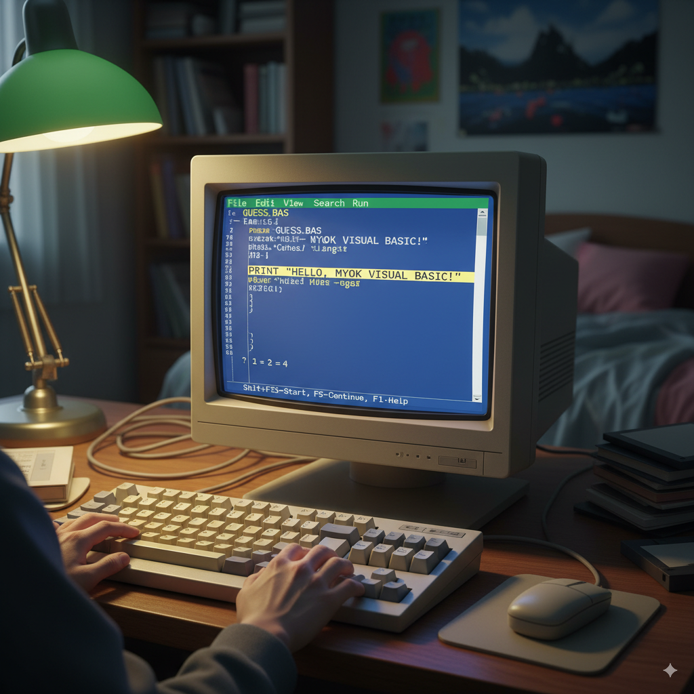

Visual Basic (VB) and QBasic are both programming languages that have been used to develop desktop applications, but they have some significant differences and are suited for different types of development.

_________
**QBasic**

*   **Interpreted Language:** QBasic is an interpreted language, meaning the code is executed line by an interpreter. This makes it easy to learn and experiment with, but generally slower than compiled languages.
*   **Procedural:** It's a procedural language, focusing on a sequence of commands and functions.
*   **DOS-based:** QBasic primarily runs in a DOS environment, making it less suitable for modern graphical user interface (GUI) desktop applications.
*   **Simple Graphics:** It has basic graphics capabilities for simple drawings and animations within the text-based or limited graphical modes.
*   **Learning Tool:** QBasic is often used as a teaching tool for beginners due to its simplicity.
*   **File Development:** You can develop simple `.BAS` files that can be run directly with a QBasic interpreter, or compiled into `.EXE` files using a compatible compiler (like QuickBasic or FreeBasic). These `.EXE` files would be console applications or very basic GUI applications.

**Visual Basic (VB)**

*   **Event-Driven and Object-Oriented (mostly):** Visual Basic, especially VB6 and earlier versions, is strongly event-driven, which is ideal for GUI applications. Modern VB.NET is fully object-oriented.
*   **Compiled Language:** VB code is compiled into an executable (`.EXE` file), making applications faster and stand-alone.
*   **Windows GUI Development:** VB was specifically designed for developing graphical applications for Windows. It provides a drag-and-drop interface for creating forms, controls (buttons, text boxes, etc.), and managing events.
*   **Rich Ecosystem:** It integrates well with Windows APIs, databases (via ADO/DAO), and other COM components, allowing for powerful and complex applications.
*   **Versions:**
    *   **VB6 (Classic Visual Basic):** Widely popular for Windows desktop development in the 90s and early 2000s. It's still used for maintaining legacy systems, but officially unsupported by Microsoft.
    *   **VB.NET (part of .NET Framework/.NET Core):** A complete rewrite that runs on the .NET platform. It's a modern, powerful language for developing a wide range of applications, including Windows Desktop (WinForms, WPF), web, and mobile.

**Comparing for Desktop and File Development:**

*   **Modern Desktop Applications:** For creating modern, robust, and feature-rich desktop applications for Windows, **Visual Basic .NET** (using WinForms or WPF) is the clear choice. It offers excellent tools, integration with the operating system, and a vast library of functionalities. VB6 can still be used for legacy systems, but it's not recommended for new development.
*   **Simple Console Applications/Learning:** If you're looking to create very simple console-based programs or are just learning the fundamentals of programming, QBasic can be a fun and straightforward starting point. However, it won't lead to modern GUI applications.
*   **File Development (General):**
    *   With QBasic, you'll mainly be developing `.BAS` files that can be run by the interpreter, or simple `.EXE` console applications.
    *   With Visual Basic (either VB6 or VB.NET), you'll be developing much more sophisticated `.EXE` files that are full-fledged Windows applications, potentially interacting with various other files (databases, configuration files, etc.).

**In Summary:**

If your goal is to develop modern desktop applications with a graphical user interface, manage files efficiently within a Windows environment, and leverage current programming practices, **Visual Basic .NET** is the way to go.

If you're interested in retro programming, learning basics, or working on very simple console utilities, QBasic can be an interesting historical language to explore.

Here's a visual representation of a classic QBasic development environment, and a modern Visual Basic .NET IDE:

**QBasic Environment**
